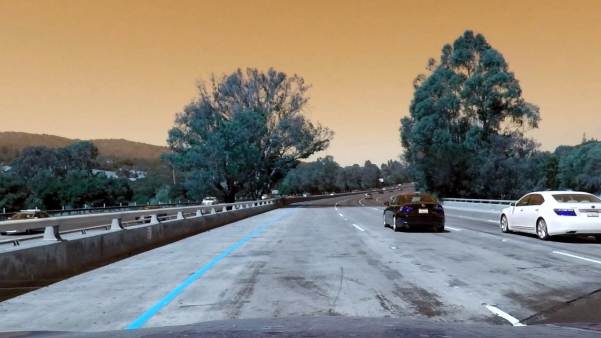

## Advanced Lane Finding
[](http://www.udacity.com/drive)


In this project, your goal is to write a software pipeline to identify the lane boundaries in a video, but the main output or product we want you to create is a detailed writeup of the project.  Check out the [writeup template](https://github.com/udacity/CarND-Advanced-Lane-Lines/blob/master/writeup_template.md) for this project and use it as a starting point for creating your own writeup.  


**Advanced Lane Finding Project**

The goals / steps of this project are the following:

* Compute the camera calibration matrix and distortion coefficients given a set of chessboard images.
* Apply a distortion correction to raw images.
* Use color transforms, gradients, etc., to create a thresholded binary image.
* Apply a perspective transform to rectify binary image ("birds-eye view").
* Detect lane pixels and fit to find the lane boundary.
* Determine the curvature of the lane and vehicle position with respect to center.
* Warp the detected lane boundaries back onto the original image.
* Output visual display of the lane boundaries and numerical estimation of lane curvature and vehicle position.


---

### I. Camera Calibration

#### 1. Briefly state how you computed the camera matrix and distortion coefficients. Provide an example of a distortion corrected calibration image.

This part of code is applied in the `camera_cal.py`.

I start by preparing "object points", which will be the (x, y, z) coordinates of the chessboard corners in the world. Here I am assuming the chessboard is fixed on the (x, y) plane at z=0,
such that the object points are the same for each calibration image.  Thus, `objp` is just a replicated array of coordinates, and `objpoints` will be appended with a copy of it every time
I successfully detect all chessboard corners in a test image.  `imgpoints` will be appended with the (x, y) pixel position of each of the corners in the image plane with each successful chessboard detection.

I then used the output `objpoints` and `imgpoints` to compute the camera calibration and distortion coefficients using the `cv2.calibrateCamera()` function.
I applied this distortion correction to the test image using the `cv2.undistort()` function and obtained this result:

The calibration coefficients are stored in the `wide_dist_pickle.p` file for later use.


&emsp;


</br>
</br>

---

### II. Pipeline (single images)

#### 1. Provide an example of a distortion-corrected image.

To demonstrate this step, I will describe how I apply the distortion correction to one of the test images like this one:

The camera distortion coefficients are already computed in the previous step, so for now, I simply get the `mtx` and `dist` from the pickle
and undistort the image by opencv function `cv2.undistort()`
</br>


&emsp;



#### 2. Describe how (and identify where in your code) you used color transforms, gradients or other methods to create a thresholded binary image.  Provide an example of a binary image result.

I used a combination of color and gradient thresholds to generate a binary image (thresholding steps at lines 24 through 56 in `advancedLaneLines.py`, function `color_gradient`).  Here's an example of my output for this step.

In this part, the `s` channel is used for color selection, and only x direction to find the sobel edges.

For threshold delection, I used ` color_thresh=(150, 255)` and `sobel_thresh=(20, 100)`


#### 3. Describe how (and identify where in your code) you performed a perspective transform and provide an example of a transformed image.

The code for my perspective transform includes a function called `warper()`.  The `warper()` function takes as inputs an image (`img`), as well as source (`src`) and destination (`dst`) points.  I chose the hardcode the source and destination points in the following manner:

```python
src_points = np.float32(
                [[img.shape[1], img.shape[0] - 10],
                [0, img.shape[0] - 10],
                [546, 460],
                [732, 460]])

des_points = np.float32(
                [[img.shape[1], img.shape[0]],
                [0, img.shape[0]],
                [0, 0],
                [img.shape[1], 0]])
```

This resulted in the following source and destination points:

| Source        | Destination   |
|:-------------:|:-------------:|
| 1280, 710      | 1280, 720        |
| 0, 710      | 0, 720     |
| 546, 460    | 0, 0     |
| 732, 460     | 1280, 0        |

I verified that my perspective transform was working as expected by drawing the `src` and `dst` points onto a test image and its warped counterpart to verify that the lines appear parallel in the warped image.

It can be found the destination points chosen for perspectiive transform are the four vertices of the image. It would make the points selection becomes easier.

After Selected the 4 pairs of points, I used the `cv2.warpPerspective` function to do the perspective transformation.


&emsp;


#### 4. Describe how (and identify where in your code) you identified lane-line pixels and fit their positions with a polynomial?

The code is accomplished in the function `find_lane_pixels` in pyhton file `advancedLaneLines.py`

For this part, the slidnig wiindow approach is applied to find the line pixels. the window margin size is defiend to be 100, and I remain the winidow quantity to 9. For each window, the center is defined to be the mean position of previous window.

By doing so, the lane lines are selected as follows:


Afterwards, the x and y pixel positions from above method are used to determine a 2nd order polynomial curve, the area between two lines should be regarded as the lane. I used the `cv2.polyfit()` to define the lane curvatures, whiich is shown as:


#### 5. Describe how (and identify where in your code) you calculated the radius of curvature of the lane and the position of the vehicle with respect to center.

I did this in function `cal_curvature()` in my code.

As mentioned above, the curvature radius function is calculated along with the coefficients A, B and C. Then the radius of curvature can be calculated via given equation.

The pixel to meter transformation is determines as `ym_per_pix = 30 / 720` and `xm_per_pix = 3.7 / 830`. These 2 parameters are adopted in calculation.

To calculate the position of the vehicle, the offset is calculated at line 257. The center pixel of the image is regarded as the center of the vehicle, and the center of 2 lines at bottom is the center of the lane. Thus, the position of the vehicle can be the distance between the 2 centers.


#### 6. Provide an example image of your result plotted back down onto the road such that the lane area is identified clearly.

Swap the source points and the destination points in Step 3 and do `warp()` again,  to transform the lane lines back to the original perspective. The wapred lane would be :


Then, use the built-in function `cv2.addWeighted()` to draw the lane onto the original image, which is shown as:


---

### Pipeline (video)

#### 1. Provide a link to your final video output.  Your pipeline should perform reasonably well on the entire project video (wobbly lines are ok but no catastrophic failures that would cause the car to drive off the road!).

Here's a [link to my video result](./output_videos/project_video.mp4)

---

### Discussion

#### 1. Briefly discuss any problems / issues you faced in your implementation of this project.  Where will your pipeline likely fail?  What could you do to make it more robust?

 When processing the challenge video, the result can be really bad. If the line is close to the corner of the wall, the perspective transform would take the block into consideratiion and regards it as the lane, this can be misleading to finding the lane lines.
 Also, when the sunlight is strong, the performance is really bad. It is mainly because there will be many white pixels with high lightness and satuation in the image, and the edges cannot be detected well.
 It should be noticed that some of the code is hard-coded, like the source points delection. Imagine the situation that the vihicle is offtrack for some reason, then the lane lines would be hard to be found.
